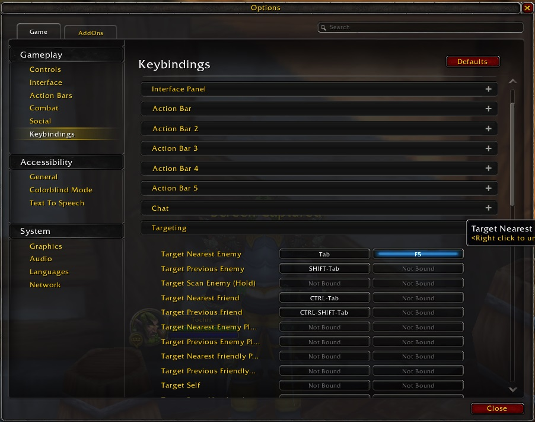
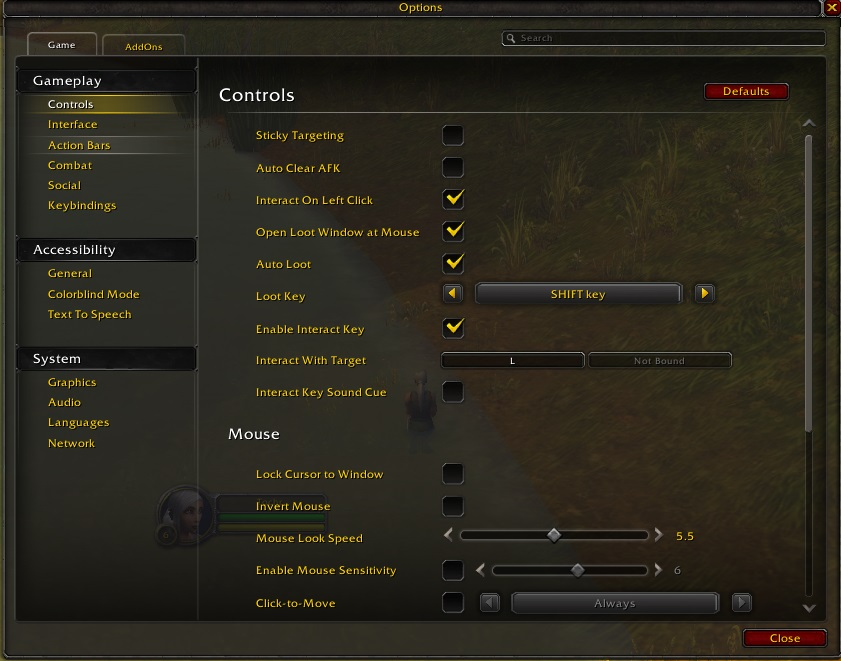
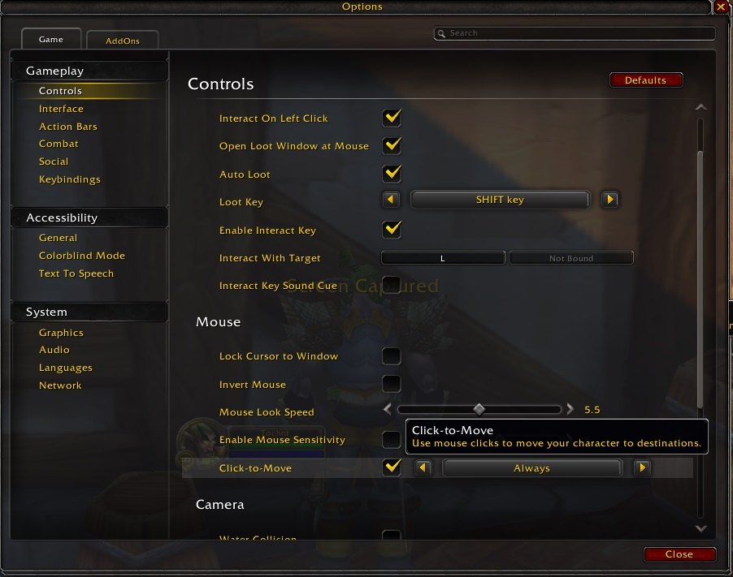
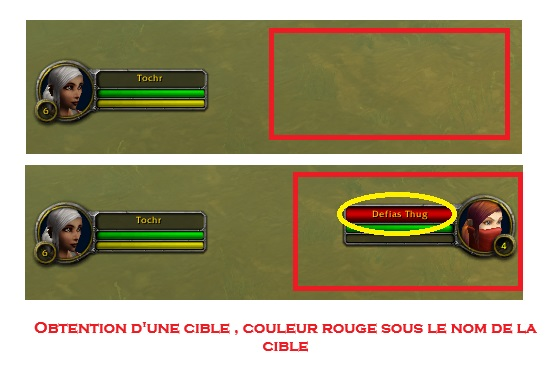
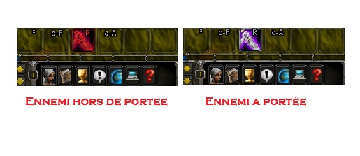
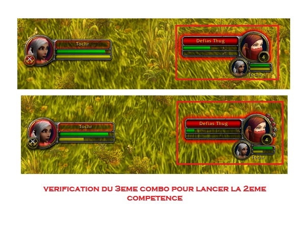
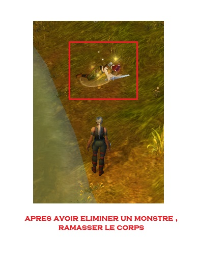
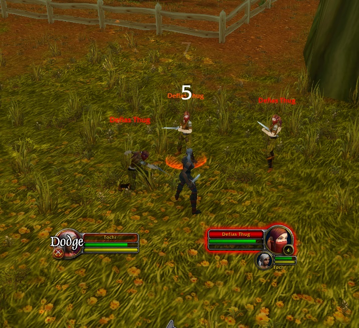
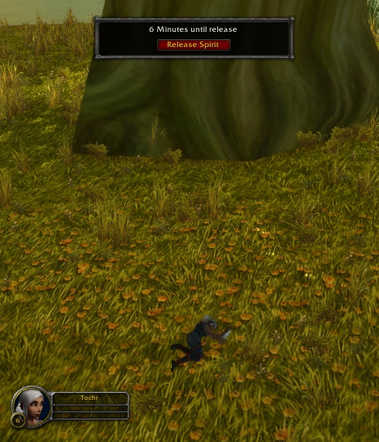

# Script d'Assistance à l'Automatisation des Combats dans World of Warcraft

## Préparation et Configuration
### 1. Configuration des touches pour cibler 
Dans le jeu, vous pouvez configurer une touche pour sélectionner des monstres :

Sélectionner un monstre à proximité : (La portée est relativement courte, généralement environ 40 mètres) touche "F5"



Ou alors nous pourrons sélectionner un monstre par son nom :
Sélectionner par nom : /target Nom (Cela sélectionne les ennemis dont le nom commence par "Nom", par exemple "Nom de la Bête", "Nom du Monstre", etc.)
Placez cette macro dans votre barre de compétences et configurez une touche rapide.( on ne l'utilisera pas ici)

### 2. Configurer les Raccourcis pour l'Interaction avec les Cibles et le Déplacement par Clic de Souris
Configuration pour interagir avec les cibles : Esc -> Options -> Cibler -> Interagir avec les cibles



Déplacement par clic de souris : Esc -> Options d'Interface -> Souris -> Cochez "Déplacement par clic de souris" -> Toujours en mode de vue

Cela permet, lorsque vous cliquez sur cette fonctionnalité, au personnage de se déplacer vers la cible (qui doit être vivante), et nous utiliserons cette fonctionnalité pour nous rapprocher des monstres.




### 3. Verrouiller la Vue
Configuration : Esc -> Options d'Interface -> Caméra -> Mode de Suivi de la Caméra : Toujours -> Vitesse de Suivi Automatique : Maximale

Cela permet de garder la caméra en mode de vue à la troisième personne, alignée avec la vue du personnage. C'est important car le personnage doit faire face au monstre lorsqu'il attaque et la plupart des monstres laissent souvent des objets à ramasser devant eux.

## Écriture du Script

1. Principes du Script
Diagramme de la Séquence d'Attaque

Conception de l'IA, à répéter par la suite

2. Conditions Clés
Existe-t-il une cible ?



La distance d'attaque est-elle suffisante ?



La santé est-elle en danger ?


Avez-vous trois points de combo pour une compétence de finition ?



Ramasser un objet



Le combat est-il terminé ? (Cela peut être vérifié en regardant si une cible était présente lors du dernier cycle, mais est absente lors du suivant.)

3. Utilisation de la bibliothèque [PyAutoGUI](https://pyautogui.readthedocs.io/en/latest/)

Fonctions Clés : press (simule l'appui sur une touche du clavier), rightClick (clic droit rapide), pixelMatchesColor (vérifie si la couleur d'un pixel correspond à une couleur spécifiée)

### 4. Pseudo-code

```
Tant que (1) {
    Si (Cible Existante (pixelMatchesColor derrière le nom  est-il rouge)) alors
        Si (Distance d'Attaque Suffisante (pixelMatchesColor le coup est-il rose)) alors
            Si (Trois Points de Combo Disponibles (pixelMatchesColor la troisième icône de combo du monstre est-elle colorée)) alors
                Canaliser une compétence d'attaque contre le monstre (Appuyer sur le bouton du clavier press : 3)
            Sinon
                Canaliser une compétence d'attaque contre le monstre (Appuyer sur le bouton du clavier press : r)
        Sinon
            Se Déplacer vers le Monstre (Appuyer sur le bouton d'interaction de la cible press : l)
    Sinon
        Si (Le combat est-il terminé récemment ?) alors
            Ramasser un objet (Clic droit rapide sur le cadavre du monstre : rightClick)
            Si (La santé est-elle en danger ? (pixelMatchesColor la barre de santé est-elle verte à 50%)) alors
                Se soigner (Se cacher pendant 20s ou utiliser un bandage, boire de l'eau)
        Sinon
            Choisir la prochaine cible (Appuyer sur le bouton du clavier correspondant à la macro de la cible : f5)

    Attendre(200 millisecondes);
}
```
### 5. Conclusion
Ceci est simplement une IA rudimentaire pour l'automatisation, veuillez l'utiliser avec prudence. En général, si vous ne surveillez pas le jeu, le résultat peut être quelque chose comme ceci :





Si cela vous intéresse, n'hésitez pas à contribuer pour améliorer le script :).
