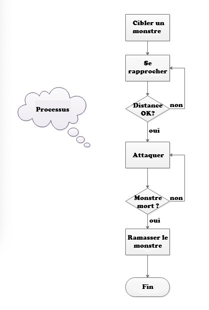
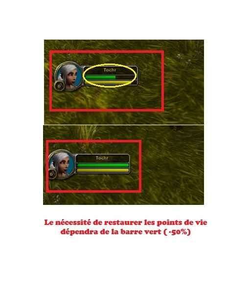

# Script d'Automatisation des Combats dans World of Warcraft

## Préparation et Configuration
### 1. Configuration des touches pour cibler 
Dans le jeu, vous pouvez configurer une touche pour sélectionner des monstres :

Sélectionner un monstre à proximité : (La portée est relativement courte, généralement environ 40 mètres) touche "F5"


Ou alors nous pourrons sélectionner un monstre par son nom :
Sélectionner par nom : /target Nom (Cela sélectionne les ennemis dont le nom commence par "Nom", par exemple "Nom de la Bête", "Nom du Monstre", etc.)
Placez cette macro dans votre barre de compétences et configurez une touche rapide.( on ne l'utilisera pas ici)

### 2. Configurer les Raccourcis pour l'Interaction avec les Cibles et le Déplacement par Clic de Souris
Configuration pour interagir avec les cibles : Esc -> Options -> Cibler -> Interagir avec les cibles


Déplacement par clic de souris : Esc -> Options d'Interface -> Souris -> Cochez "Déplacement par clic de souris" -> Toujours en mode de vue

Cela permet, lorsque vous cliquez sur cette fonctionnalité, au personnage de se déplacer vers la cible (qui doit être vivante), et nous utiliserons cette fonctionnalité pour nous rapprocher des monstres.


### 3. Verrouiller la Vue
Configuration : Esc -> Options d'Interface -> Caméra -> Mode de Suivi de la Caméra : Toujours -> Vitesse de Suivi Automatique : Maximale

Cela permet de garder la caméra en mode de vue à la troisième personne, alignée avec la vue du personnage. C'est important car le personnage doit faire face au monstre lorsqu'il attaque et la plupart des monstres laissent souvent des objets à ramasser devant eux.

## Écriture du Script

1. Principes du Script

Diagramme de la Séquence d'Attaque



2. Conditions Clés
   
Existe-t-il une cible ?


La distance d'attaque est-elle suffisante ?


La santé est-elle en danger ?



Avez-vous trois points de combo pour une compétence de finition ?


Ramasser un objet


Le combat est-il terminé ? (Cela peut être vérifié en regardant si une cible était présente lors du dernier cycle, mais est absente lors du suivant.)

3. Utilisation de la bibliothèque [PyAutoGUI](https://pyautogui.readthedocs.io/en/latest/)

Fonctions Clés : press (simule l'appui sur une touche du clavier), rightClick (clic droit rapide), pixelMatchesColor (vérifie si la couleur d'un pixel correspond à une couleur spécifiée)

### 4. Pseudo-code

```
While (1) {
    If (Existing Target (pixelMatchesColor behind the name is red)) then
        If (Sufficient Attack Distance (pixelMatchesColor the hit is pink)) then
            If (Three Combo Points Available (pixelMatchesColor the third combo icon of the monster is colored)) then
                Channel an attack skill against the monster (Press the keyboard button: 3)
            Else
                Channel an attack skill against the monster (Press the keyboard button: r)
        Else
            Move towards the Monster (Press the target interaction button: l)
    Else
        If (Has the fight ended recently?) then
            Loot an item (Quick right-click on the monster's corpse: rightClick)
            If (Is health in danger? (pixelMatchesColor is the health bar green at 50%)) then
                Heal (Hide for 20s or use a bandage, drink water)
        Else
            Choose the next target (Press the keyboard button corresponding to the target macro: f5)

    Wait(200 milliseconds);
}
```
### 5. Conclusion
Ceci est simplement une IA rudimentaire pour l'automatisation, veuillez l'utiliser avec prudence. 
Il se peut parfois que le résultat peut être quelque chose comme ceci :


Il faudra ajouter un moyen de retourner vers le corps.

Si cela vous intéresse, n'hésitez pas à contribuer pour améliorer le script :).
